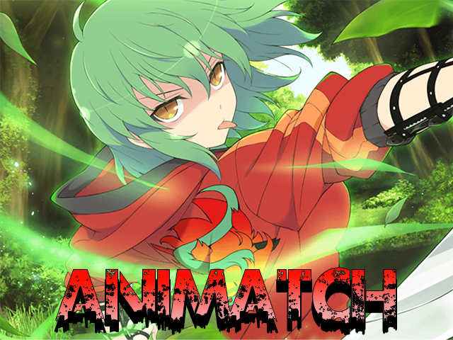

# Animatch:

## Sommaire/Summary:

* **[Français](#français)**
* **[English](#english)**

## <a id="francais">Français:</a>

###  Présentation:
Animatch est un prototypage d'un moteur de jeu très basique de type match 3 créé avec GodotEngine. Le prototype est codé en GDscript, Langage de programmation unique à GodotEngine. Je me suis inspiré du tutoriel de SoloGodot et de different animée/mangs Japonais. Le but de ce projet était de comprendre et d'apprendre le fonctionnement d'un jeu du même type qu'un Candy Crush ou d'un Aggretsuko. Ce prototype de jeu n'a pas pour but d'être commercialisé, c'est un projet d'apprentissage, dans le cas que je voudrais le commercialiser je ne pourrais pas car il ne respecte dans aucun cas les copyrights de ces licences respectives et j'en ai conscience.

### Fonctionnalité:
Le jeu est capable de générer une grille de manière aléatoire, de faire les vérifications sur 5 cases adjasantes à la tuile de manière verticale et horizontale. Un système de scoring est en place et un calcule des tuiles restantes aussi. Dans les choses manquantes il reste à faire pour le moment un système pour dire que le niveau est terminé, un compteur de coup restant, des animations et des tuiles plus propres. C'est un prototype très peu abouti mais fonctionnel pour s'amuser un peu et faire des tests.

### Version actuelle du projet:
Version: Alpha.0.0.1

### En cours de développement:
Projet en pause actuellement 

### À l'avenir:
* Vérification en carrer des tuiles
* Création d'objet (par exemple: Bombe qui permet d'exploser un certain nombre de tuiles sur une zone)
* Changer entièrement les images des tuiles pour des objets qui seront lier au point suivant
* Création de personnages qui auront leur propre type de tuile pour activer un pouvoir pouvant aider le joueur à accomplir ces objectifs
* Ajout d'une limite de coups pour finir un niveau
* Ajout de musique

D'autres fonctionnalité viendront s'ajouter à l'avenir

## <a id="english">English:</a>

###  Presentation:
Animatch is a prototyping of a very basic match 3 game engine created with GodotEngine. The prototype is encoded in GDscript, a unique programming language for GodotEngine. I was inspired by the SoloGodot tutorial and different Japanese anime/mangs. The goal of this project was to understand and learn the functioning of a game of the same type as a Candy Crush or an Aggretsuko. This prototype game is not intended to be commercialized, it is a learning project, in case I would like to commercialize it I could not because it does not respect in any case the copyrights of these respective licenses and I am aware of that.

### Functionality:
The game is able to generate a grid randomly, to do the checks on 5 boxes adjasantes to the tile vertically and horizontally. A scoring system is in place and one calculates the remaining tiles as well. In the missing things it remains to do for the moment a system to say that the level is finished, a counters remaining, more clean animations and tiles. It’s a very rough prototype but functional to have some fun and do some tests.

### Current version of the project:
Version: Alpha.0.0.1

### Under development:
Project currently on hold

### in future
* Tile check square
* Object creation (for example: Bomb that can explode a number of tiles on an area)
* Completely change tile images to objects that will link to the next point
* Creating characters that will have their own tile type to activate a power that can help the player achieve these goals
* Adding a hit limit to finish a level
* Add music

More functionality will be added in the future